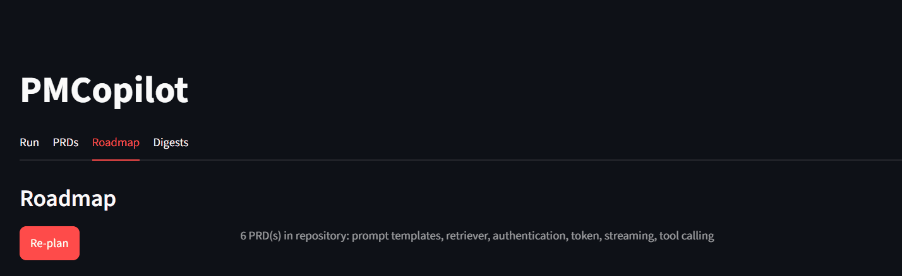
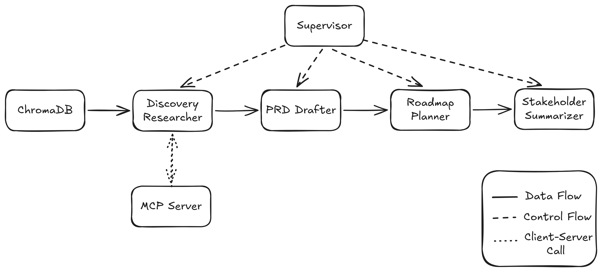
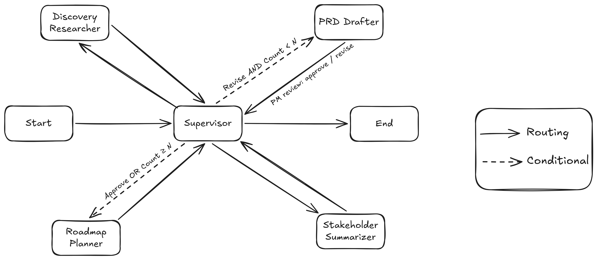
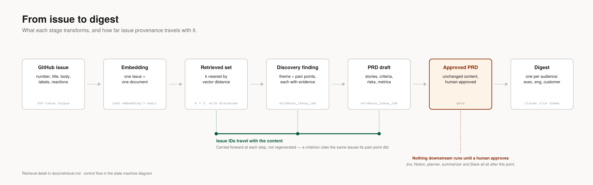

# PMCopilot

**A multi-agent system that turns a collected corpus of product issues into a PRD, a prioritized roadmap, and per-stakeholder summaries — with a human approval gate in the middle.**

LangGraph · Anthropic API · ChromaDB · MCP · Pydantic v2 · Streamlit

**[Watch the walkthrough (10 min)](https://www.loom.com/share/8e08cd67d2674987bc3a2e5326bc77c5)** — the system running end to end: a PRD drafted from the corpus, revised at the approval gate, then planned and summarized.

---

## Results

### Acceptance-criterion quality: 1.44 → 4.33

Output is scored by an LLM-as-Judge on four dimensions, 1–5. Opus judges Sonnet's
output, so the judge's blind spots don't correlate with the drafter's.

| dimension | [v1](./evals/results_v1.json) | [v2a](./evals/results_v2.json) | [v2b](./evals/results_v3.json) | target | |
|---|---|---|---|---|---|
| **ac_quality** | 1.44 | 2.67 | **4.33** | ≥ 4.5 | miss |
| completeness | 4.33 | 4.33 | 4.11 | ≥ 4.0 | meets |
| hallucination | 3.89 | 4.00 | 4.00 | all 5 | miss |
| grounding | 3.33 | 4.00 | 3.89 | all 5 | miss |

Nine scenarios, the same nine in each column. A prompt change forces a re-draft,
so each column is one capture of a different prompt generation. Column headers link to
the run that produced them — filenames count captures while labels count prompt
generations, so v2b is `results_v3.json`; the [suite index](./evals/README.md) explains the
divergence. Each file carries per-scenario scores and the judge's findings, so any cell
above can be traced to the criteria behind it.

**v1 failed badly.** The judge flagged 40 defective acceptance criteria across nine
PRDs — criteria bundling several assertions into one, or asserting outcomes no
reviewer could settle.

**Two revisions to the drafter's `SYSTEM_PROMPT` took that to 3.** No schema, model,
or retrieval change. And what moved it was not clearer instruction — the rules were
already stated in prose and were being ignored. Each revision added one worked
`bad → good` example beside the rule it belonged to.

| defect type | v1 | after example 1 | after example 2 |
|---|---|---|---|
| non-atomic | 20 | 5 | 1 |
| vague | 14 | 8 | 2 |
| redundant pair | 6 | 0 | 0 |

**The target is missed.** `PRD.md` commits to 4.5; this reached 4.33, and the bar was
not moved to meet it. Two dimensions nobody targeted also moved — grounding by +0.56
and hallucination by +0.11 — so the fixes were less narrow than intended.

### Re-drafting the same nine scenarios scored 3.00

The ±0.2 spread first published here as a noise floor came from judging one frozen set
of PRDs twice. It measures how consistently the **judge** scores a fixed artifact. It
says nothing about how consistently the **drafter** produces them.

Re-drafting the same nine at a byte-identical prompt scored
**[3.00](./evals/results_v4.json)** on ac_quality —
1.33 below the column above it. That capture also carries the schema fix described
below, so 1.33 is an upper bound on redraft noise rather than a measurement of it.

What survives: the 2.89 gain from worked examples is more than twice the 1.33 swing,
so the direction of the result holds. What doesn't: a 0.17 miss against a 4.5 target
is finer than this apparatus can resolve, and every delta in the table above carries
redraft noise of unmeasured size.

### A schema defect was costing 27% of every run's input tokens

Instrumenting the pipeline end-to-end surfaced what the eval suite couldn't see.
The drafter's forced tool call returned the PRD nested one level deep. Validation
read the required fields as missing, and the repair loop burned retries
recovering *shape* rather than fixing *content*.

| | before | after |
|---|---|---|
| input tokens / run | 58,649 | **42,740** |
| drafter tokens | 20,487 | **4,475** |
| repair fires (10-theme capture) | 13 | **0** |
| scenarios captured | 9 of 10 | **10 of 10** |

The obvious cause was the JSON Schema's own `title`, which named the key the
model was reaching for. **That hypothesis was wrong** — with the title removed,
the model still nested under the same key. What shipped is a guarded unwrap that
emits its own telemetry event, so the defect is corrected without a retry *and*
stays visible in the transcript instead of vanishing into a clean number. That
instrumentation is what caught the bad hypothesis; a silent fix would have
produced identical numbers and let the wrong explanation ship.

Current evidence points at the tool's *name*: first-pass drafts nest every time,
while a revision pass — which carries a correctly-shaped PRD in context — does
not. n=1 on the revise side, recorded as an open question, not a finding.

### Cost, measured

| segment | tokens in | tokens out | calls |
|---|---|---|---|
| discovery | 24,463 | 598 | 1 |
| drafting | 4,475 | 2,264 | 1 |
| planning | 3,901 | 362 | 2 |
| summarizing (3 audiences + Slack) | 9,901 | 3,926 | 4 |

Clean run, n=2, spread ±0.39%, from
[run 1](./evals/telemetry_run1.json) and [run 2](./evals/telemetry_run2.json); the
[before-side](./evals/telemetry_pre_envelope_fix.json) of the schema fix is recorded
separately. A revision adds 11.0% to input. Planner measured at one PRD — the floor,
not the operating point.

Discovery is 57% of a clean run's input in a single call.

---

## The problem

A PM builds next quarter's roadmap in 4–5 days. The raw signal already exists but
is unstructured and scattered. PMCopilot **does not gather** issues — the PM
arrives with the corpus. It structures and reasons over it, with guardrails
against inventing or inflating what isn't there.

Full framing in [PRD.md](./PRD.md).

| agent | takes | produces |
|---|---|---|
| **Discovery Researcher** | raw issue corpus | themed findings, each grounded in cited issue IDs |
| **PRD Drafter** | themed findings | validated PRD with testable, atomic acceptance criteria |
| **Roadmap Planner** | approved PRDs | priority scores, dependencies, target quarters |
| **Stakeholder Summarizer** | approved PRD | audience-tailored digests, one per stakeholder group |

---

## Architecture

A LangGraph supervisor orchestrates the four agents. Data flows through the
agents; the supervisor routes *control* only. Discovery calls an MCP server as an
external tool.

Control is hub-and-spoke: every agent returns to the supervisor, which owns all
routing plus START and END. After the drafter runs, a **human-in-the-loop gate**
lets the PM approve or request a revision in free text; the revise loop is
bounded.

Data moves through those agents as a chain of transformations, and issue
provenance rides along with it: a pain point cites the issues it came from, and
the acceptance criteria drafted from it cite the same ones.

The MCP server exposes ten mock filing tools across Jira, Notion, and Slack.
[Install and configuration](./mcp_server/README.md) covers running it from
Claude Desktop.

---
## Design notes

Longer write-ups, kept out of this page:

- **[Retrieval layer](./docs/retrieval.md)** — why one issue is one document, why
  the index build is a script and the query path is a library, and why raw vector
  distance is a weak relevance signal on a corpus of GitHub issues that all share
  template boilerplate.
- **[PRD.md](./PRD.md)** — the product spec this system was built against,
  including the success-metric targets the Results section is scored on.
- **[Eval suite](./evals/)** — fixtures, judge prompt, and per-run results. Every
  number above is re-judgeable from a committed fixture.

---

## What I'd do next

- **Redraft noise.** One re-capture at an unchanged prompt moved ac_quality by 1.33,
  and it was confounded with a schema fix. Two captures on each side of that fix would
  separate sampling from the fix and put a real error bar on every delta above.
- **Acceptance-criterion ceiling.** Half the corpus now hits `max_length=8`. The
  earlier decision not to raise it was measured on output drafted under repair
  pressure, which appears to suppress criterion counts. Open again.
- **Discovery cost.** One call carries 57% of a run's input. Nothing has tested
  whether the full retrieved set is load-bearing.
- **Planner at scale.** Every measurement so far plans a single PRD. Scoring
  differentiation, dependency edges, and quarter spreading are unexercised.
- **Grounding and hallucination.** Neither has reached the zero-tolerance bar, and
  grounding moved +0.56 across the series without being targeted — an unexplained
  shift on a dimension no revision addressed. The prompt's worked example demonstrates
  confident invented numerics — a plausible contributor, deliberately not changed
  while acceptance criteria were the variable under test.
