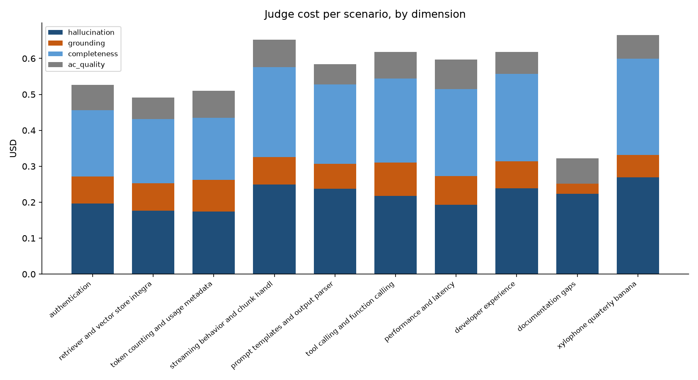
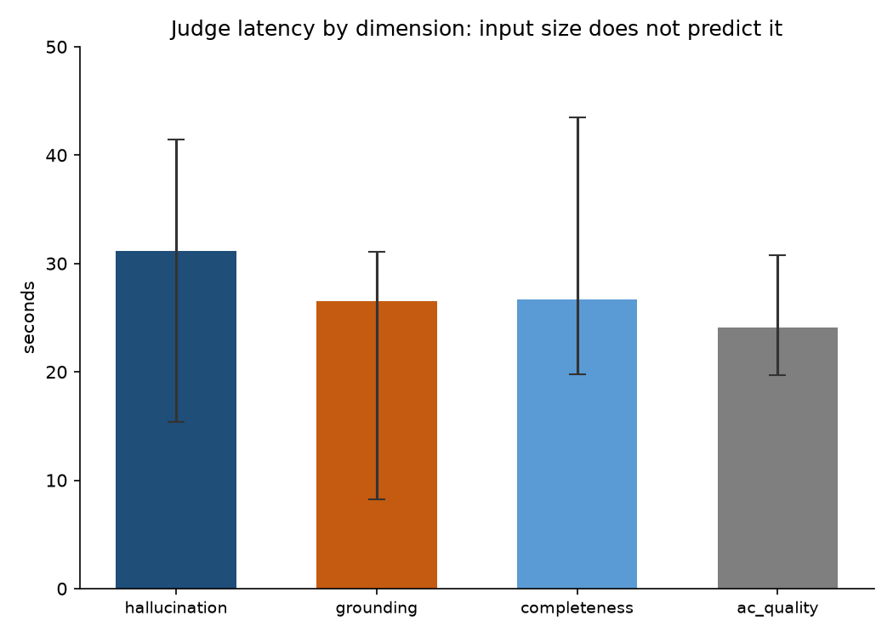

# C9 eval report — PMCopilot v1

Fixture `c19d36d`, captured 2026-08-03. Drafter `claude-sonnet-5`, judge `claude-opus-5`, K=8.

Scores from 2 independent judge runs over the same frozen fixture (baseline, variance-2). The fixture does not move between runs, so any score difference is judge sampling variance and nothing else. Cost and latency come from `variance-2` only — the baseline run predates instrumentation.

## Pass bars

| dimension | baseline | variance-2 | spread | cells moved | target | verdict |
|---|---|---|---|---|---|---|
| hallucination | 4.00 | 4.10 | 0.10 | 3/10 | all score 5 (mean 5.0, zero below 5) | **MISSES** |
| grounding | 3.50 | 3.70 | 0.20 | 2/10 | all score 5 (mean 5.0, zero below 5) | **MISSES** |
| completeness | 4.33 | 4.44 | 0.11 | 1/9 | mean >= 4.0 | **MEETS** |
| ac_quality | 1.40 | 1.40 | 0.00 | 0/10 | mean >= 4.5 | **MISSES** |

Verdicts are taken from the worst run, not the mean across runs.

## Cost and latency

One full run: 39 calls, 667,592 input and 89,850 output tokens, **$5.58**, 17.7 minutes wall clock.

| dimension | avg input | avg output | USD | median s | max s |
|---|---|---|---|---|---|
| hallucination | 31,585 | 2,382 | 2.17 | 31.1 | 41.4 |
| grounding | 4,187 | 2,062 | 0.72 | 26.5 | 31.1 |
| completeness | 30,782 | 2,702 | 1.99 | 26.6 | 43.5 |
| ac_quality | 3,283 | 2,109 | 0.69 | 24.1 | 30.7 |

### Per scenario

| scenario | band | hall base | hall vari | grou base | grou vari | comp base | comp vari | ac_q base | ac_q vari | USD | median s |
|---|---|---|---|---|---|---|---|---|---|---|---|
| authentication | simple | 4 | 3 | 3 | 4 | 4 | 4 | 1 | 1 | 0.53 | 26.4 |
| retriever and vector store integrations | simple | 3 | 4 | 2 | 2 | 4 | 4 | 2 | 2 | 0.49 | 28.9 |
| token counting and usage metadata | simple | 4 | 4 | 4 | 4 | 4 | 4 | 1 | 1 | 0.51 | 28.7 |
| streaming behavior and chunk handling | simple | 5 | 5 | 4 | 4 | 5 | 5 | 1 | 1 | 0.65 | 28.0 |
| prompt templates and output parsers | simple | 4 | 4 | 3 | 3 | 5 | 5 | 2 | 2 | 0.58 | 25.1 |
| tool calling and function calling | ambiguous | 4 | 4 | 4 | 4 | 5 | 5 | 1 | 1 | 0.62 | 28.4 |
| performance and latency | ambiguous | 3 | 4 | 3 | 3 | 3 | 4 | 1 | 1 | 0.60 | 29.5 |
| developer experience | ambiguous | 4 | 4 | 3 | 3 | 4 | 4 | 3 | 3 | 0.62 | 31.4 |
| documentation gaps | adversarial | 5 | 5 | 5 | 5 | — | — | 1 | 1 | 0.32 | 15.4 |
| xylophone quarterly banana | adversarial | 4 | 4 | 4 | 5 | 5 | 5 | 1 | 1 | 0.67 | 22.4 |

